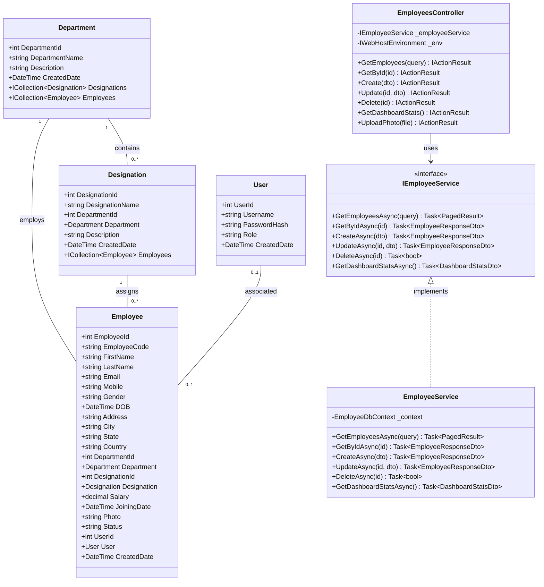

# Class Diagram

This document contains the domain class structure and controller architecture for the **Employee Management System**.

```mermaid
classDiagram
    class User {
        +int UserId
        +string Username
        +string PasswordHash
        +string Role
        +DateTime CreatedDate
    }

    class Department {
        +int DepartmentId
        +string DepartmentName
        +string Description
        +DateTime CreatedDate
        +ICollection~Designation~ Designations
        +ICollection~Employee~ Employees
    }

    class Designation {
        +int DesignationId
        +string DesignationName
        +int DepartmentId
        +Department Department
        +string Description
        +DateTime CreatedDate
        +ICollection~Employee~ Employees
    }

    class Employee {
        +int EmployeeId
        +string EmployeeCode
        +string FirstName
        +string LastName
        +string Email
        +string Mobile
        +string Gender
        +DateTime DOB
        +string Address
        +string City
        +string State
        +string Country
        +int DepartmentId
        +Department Department
        +int DesignationId
        +Designation Designation
        +decimal Salary
        +DateTime JoiningDate
        +string Photo
        +string Status
        +int UserId
        +User User
        +DateTime CreatedDate
    }

    class IEmployeeService {
        <<interface>>
        +GetEmployeesAsync(query) Task~PagedResult~
        +GetByIdAsync(id) Task~EmployeeResponseDto~
        +CreateAsync(dto) Task~EmployeeResponseDto~
        +UpdateAsync(id, dto) Task~EmployeeResponseDto~
        +DeleteAsync(id) Task~bool~
        +GetDashboardStatsAsync() Task~DashboardStatsDto~
    }

    class EmployeeService {
        -EmployeeDbContext _context
        +GetEmployeesAsync(query) Task~PagedResult~
        +GetByIdAsync(id) Task~EmployeeResponseDto~
        +CreateAsync(dto) Task~EmployeeResponseDto~
        +UpdateAsync(id, dto) Task~EmployeeResponseDto~
        +DeleteAsync(id) Task~bool~
        +GetDashboardStatsAsync() Task~DashboardStatsDto~
    }

    class EmployeesController {
        -IEmployeeService _employeeService
        -IWebHostEnvironment _env
        +GetEmployees(query) IActionResult
        +GetById(id) IActionResult
        +Create(dto) IActionResult
        +Update(id, dto) IActionResult
        +Delete(id) IActionResult
        +GetDashboardStats() IActionResult
        +UploadPhoto(file) IActionResult
    }

    Department "1" -- "0..*" Designation : contains
    Department "1" -- "0..*" Employee : employs
    Designation "1" -- "0..*" Employee : assigns
    User "0..1" -- "0..1" Employee : associated
    IEmployeeService <|.. EmployeeService : implements
    EmployeesController --> IEmployeeService : uses
```
